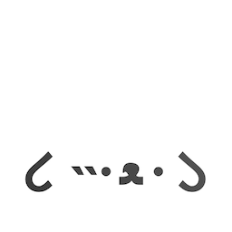

<div align="center">



</div>

# Doars

Build reactive web pages without leaving your HTML. Large font-end frameworks come at a big cost from compiling to loading. Doars is a declarative and light solution that scans the web page and processes the directives found as well as keep the state and content up to date.

Write logic directly in your layout. Simply look at the HTML and read what it does, not just what structure it has. You won't need to dig through other files since the functionality is written on the relevant element itself.

```HTML
<!-- Add library to the document from a CDN. -->
<script src="https://cdn.jsdelivr.net/npm/@doars/doars@1/dst/doars.umd.js"></script>
<script>
  // Wait for the DOM to be interactive.
  document.addEventListener('DOMContentLoaded', () => {
    // Setup a library instance.
    const doars = new window.Doars();
    // Enable library.
    doars.enable();
  });
</script>

<!-- Define component with a list of messages. -->
<div d-state="{ messages: [ 'Hello there!', 'General Kenobi.' ] }">
  <!-- Create a list item for each message. -->
  <ol>
    <template d-for="message of messages">
      <li d-text="message"></li>
    </template>
  </ol>

  <!-- Store input as a reference. -->
  <input type="text" d-reference="input">

  <!-- On click add input value to the messages. -->
  <button d-on:click="messages.push($references.input.value); $references.input.value = ''">Add</button>
</div>
```

But don't worry, the markup is still yours! We promise we won't take it away. You can still modify the document directly in code and we will do all the work to stay up to date.

Use as much or as little as you want. Doars can easily be added to an existing project since this solution doesn't force you to adopt an application wide architecture. You only need to load the library onto the page and add instructions in the form of attributes to your layouts.

## Packages

This mono-repository includes the core library as well as several plugins. See the full list below or the packages directory.

| Name                                                                                         | Description                                                                                                    |
| -------------------------------------------------------------------------------------------- | -------------------------------------------------------------------------------------------------------------- |
| [@doars/doars](https://github.com/doars/doars/tree/main/packages/doars#readme)               | The core library, it manages the components and plugins as well as includes the basic contexts and directives. |
| [@doars/doars-alias](https://github.com/doars/doars/tree/main/packages/doars-alias#readme)   | Plugin for creating aliases or renaming any context or directive.                                              |
| [@doars/doars-fetch](https://github.com/doars/doars/tree/main/packages/doars-fetch#readme)   | Plugin that adds a fetch context that handles parsing the returned content.                                    |
| [@doars/doars-router](https://github.com/doars/doars/tree/main/packages/doars-router#readme) | Plugin that adds a router context with set of directives to control it.                                        |
| [@doars/doars-store](https://github.com/doars/doars/tree/main/packages/doars-store#readme)   | Plugin that adds a store context for global state management.                                                  |
| [@doars/doars-update](https://github.com/doars/doars/tree/main/packages/doars-update#readme) | Plugin that adds an update loop context and directive.                                                         |
| [@doars/doars-view](https://github.com/doars/doars/tree/main/packages/doars-view#readme)     | Plugin that adds a view directive for reacting to intersection changes.                                        |
